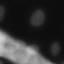
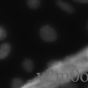
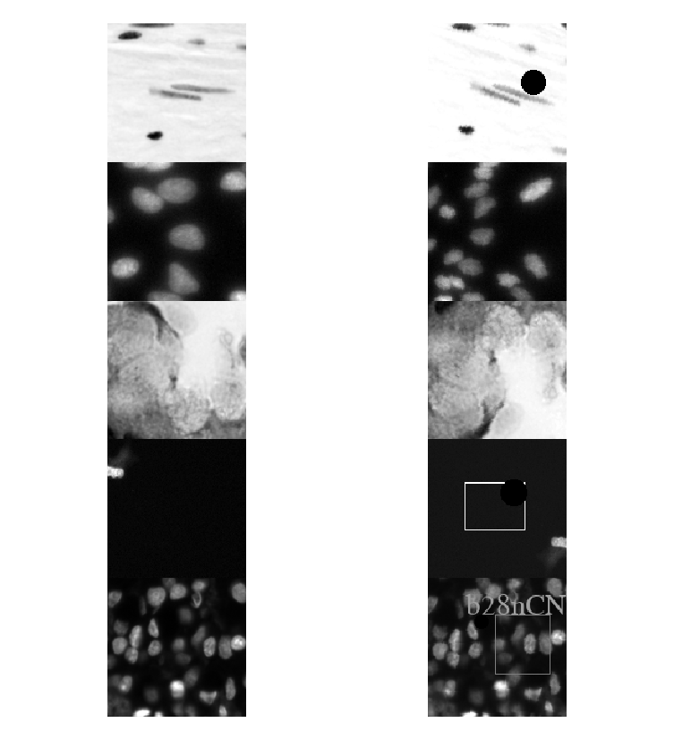
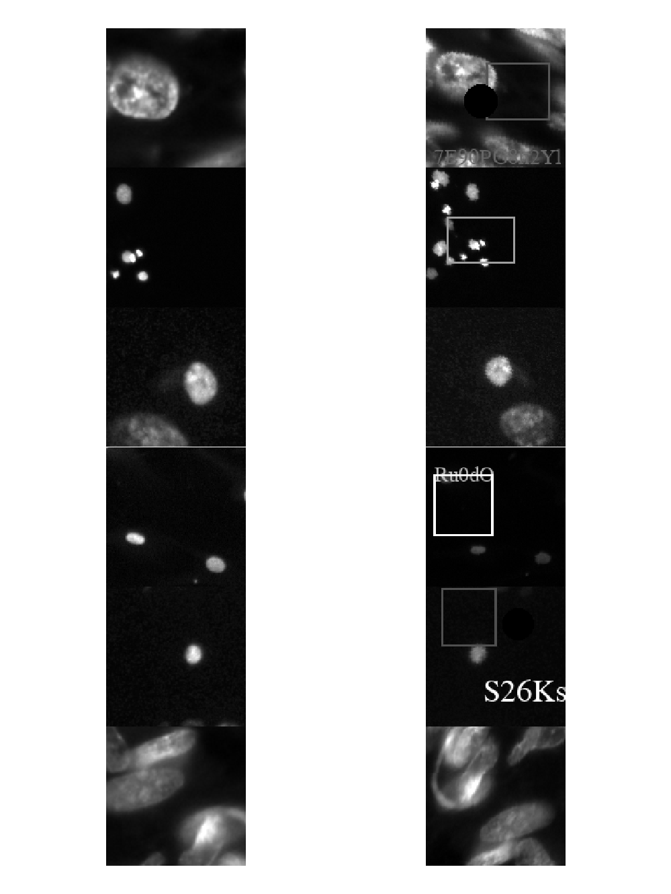
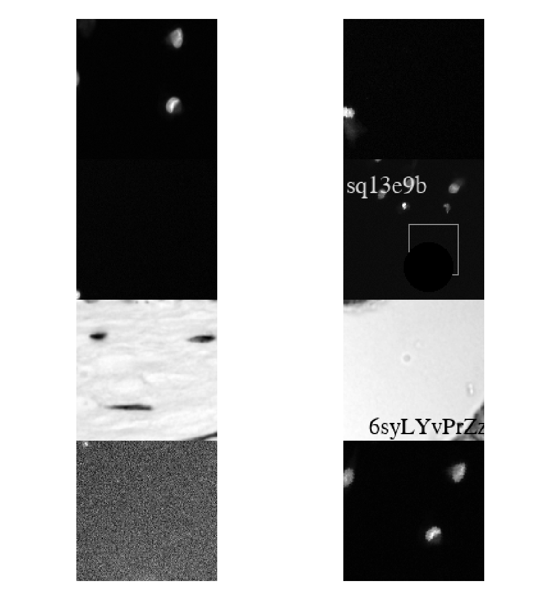

# ImageForensics - *Unofficial* PyTorch Implementation

**Detecting duplication of scientific images with manipulation-invariant image similarity**<br>
M. Cicconet, H. Elliott, D.L. Richmond, D. Wainstock, M. Walsh<br>

Paper: https://arxiv.org/abs/1802.06515<br>
Website: https://hms-idac.github.io/ImageForensics<br>

Dataset being used to create synthetic data is the [Kaggle 2018 Data Science
Bowl](https://data.broadinstitute.org/bbbc/BBBC038/) from the Broad Institute
Bioimage Benchmark Collection. Network architecture has been very slightly
modified from paper (see `model.py`). Synthetic data is created in `dataset.py`
using manipulations defined in `manipulations.py` as well as transforms included
in [torchvision](https://pytorch.org/docs/stable/torchvision/transforms.html).

## Experimental Addition: Gradient-based Localization 

See *why* images are detected as similar using an approach similar to that of
Gradient-weighted Class Activation Mapping (Grad-CAM): https://arxiv.org/abs/1610.02391. 

We calculate the gradient of the distance
between two image representations with respect to the activations of a
convolutional layer. These gradients are global average pooled, and then
linearly combined with the original forward activations, creating a heatmap. Example:

**Image**



**Manipulated**<br>
Note rotation, text, change of scale and brightness



**Grad-CAM Image**


**Grad-CAM Manipulated**


## Example Detections



# Usage

## Requirements

 * Tested on Ubuntu 18.04.3 LTS, Python 3.7.5, PyTorch 1.2.0


## Download Data

```shell
make download
```

## Train

```shell
python train.py -h
usage: train.py [-h] [--n_epochs N_EPOCHS] [--patience PATIENCE] [--bs BS]
                [--lr LR] [--train_dir TRAIN_DIR] [--valid_dir VALID_DIR]

optional arguments:
  -h, --help            show this help message and exit
  --n_epochs N_EPOCHS   max number of epochs
  --patience PATIENCE   number of epochs without improvement before stopping
  --bs BS               size of batches
  --lr LR               learning rate
  --train_dir TRAIN_DIR
                        training data location
  --valid_dir VALID_DIR
                        validation data location
```

## Test

View test examples

```shell
python test.py -h
usage: test.py [-h] [--bs BS] [--weights WEIGHTS] [--test_dir TEST_DIR]
               [--display]

optional arguments:
  -h, --help           show this help message and exit
  --bs BS              size of batches
  --weights WEIGHTS    model weights location
  --test_dir TEST_DIR  test data location
  --display            display examples from each batch
```

## Gradient Localization

Creates example gradient localization

```shell
python grad_loc.py -h
usage: grad_loc.py [-h] [--weights WEIGHTS] [--test_dir TEST_DIR]

optional arguments:
  -h, --help           show this help message and exit
  --weights WEIGHTS    model weights location
  --test_dir TEST_DIR  test data location
```

## Example Incorrect Predictions

### Should Detect Same



### Should Detect Different




